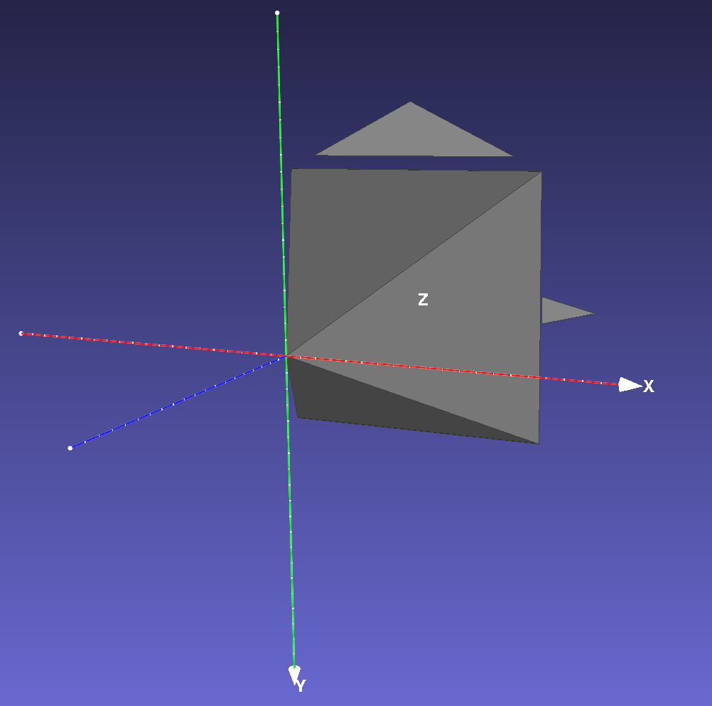

# Saving 3D camera poses to mesh

This repository implements a simple, dependency-free utility function that saves a set of camera poses into a mesh file.
One can open the saved file using any 3D software (e.g. meshlab) to visualize the camera poses. The canonical camera (extrinsic matrix is an identity matrix) is visualized below:

The purpose of this repo is to provide an easy way to debug camera related 3D coordinate space conversion. Visualization is always the best way to check whether the camera matrix are correct or not.

## Usage
It only contains single function that is well commented, 
which is pretty straightforward to use.

Currently only OpenCV camera space is implemented.
